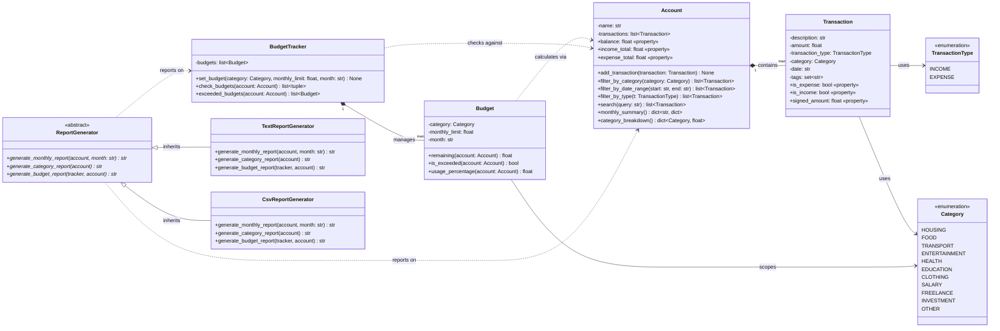

```mermaid
classDiagram
    direction LR

    %% Enumerations
    class Category {
        <<enumeration>>
        HOUSING
        FOOD
        TRANSPORT
        ENTERTAINMENT
        HEALTH
        EDUCATION
        CLOTHING
        SALARY
        FREELANCE
        INVESTMENT
        OTHER
    }

    class TransactionType {
        <<enumeration>>
        INCOME
        EXPENSE
    }

    %% Classes
    class Transaction {
        -description: str
        -amount: float
        -transaction_type: TransactionType
        -category: Category
        -date: str
        -tags: set~str~
        +is_expense: bool <color:gray>«property»</color>
        +is_income: bool <color:gray>«property»</color>
        +signed_amount: float <color:gray>«property»</color>
    }

    class Account {
        -name: str
        -transactions: list~Transaction~
        +add_transaction(transaction: Transaction) None
        +balance: float <color:gray>«property»</color>
        +income_total: float <color:gray>«property»</color>
        +expense_total: float <color:gray>«property»</color>
        +filter_by_category(category: Category) list~Transaction~
        +filter_by_date_range(start: str, end: str) list~Transaction~
        +filter_by_type(t: TransactionType) list~Transaction~
        +search(query: str) list~Transaction~
        +monthly_summary() dict~str, dict~
        +category_breakdown() dict~Category, float~
    }

    class Budget {
        -category: Category
        -monthly_limit: float
        -month: str
        +remaining(account: Account) float
        +is_exceeded(account: Account) bool
        +usage_percentage(account: Account) float
    }

    class BudgetTracker {
        -budgets: list~Budget~
        +set_budget(category: Category, monthly_limit: float, month: str) None
        +check_budgets(account: Account) list~tuple~
        +exceeded_budgets(account: Account) list~Budget~
    }

    class ReportGenerator {
        <<abstract>>
        +generate_monthly_report(account, month: str)* str
        +generate_category_report(account)* str
        +generate_budget_report(tracker, account)* str
    }

    class TextReportGenerator {
        +generate_monthly_report(account, month: str) str
        +generate_category_report(account) str
        +generate_budget_report(tracker, account) str
    }

    class CsvReportGenerator {
        +generate_monthly_report(account, month: str) str
        +generate_category_report(account) str
        +generate_budget_report(tracker, account) str
    }

    %% Relationships
    Transaction --> TransactionType : uses
    Transaction --> Category : uses
    Account "1" *-- "many" Transaction : contains
    Budget --> Category : scopes
    BudgetTracker "1" *-- "many" Budget : manages
    
    ReportGenerator <|-- TextReportGenerator : inherits
    ReportGenerator <|-- CsvReportGenerator : inherits

    %% Method dependency indicators
    Budget ..> Account : calculates via
    BudgetTracker ..> Account : checks against
    ReportGenerator ..> Account : reports on
    ReportGenerator ..> BudgetTracker : reports on

```